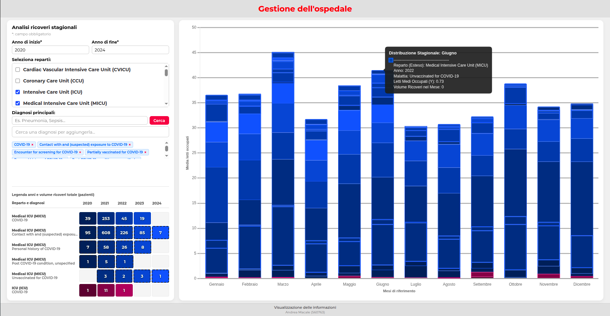
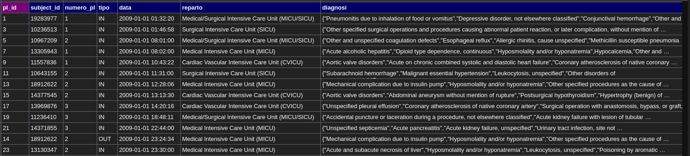

# Progetto di Visualizzazione delle Informazioni
## Andrea Macale (matricola 560793)

L'applicazione è un sistema di visualizzazione delle informazioni implementato su interfaccia Web, che rappresenta l'occupazione media mensile dei letti, inserendo un intervallo di anni. L'utente finale può inoltre usare dei filtri, inserendo uno o più reparti; ed una o più diagnosi. Come sistema di visualizzazione, è stato implementato un istogramma a pila, per poter confrontare l'occupazione letti della stessa diagnosi, mese e reparto in due o più anni differenti.

## Linguaggi utilizzati
I linguaggi utilizzati sono i seguenti:
* per il backend, è stato usato Node.js ed Express;
* per il frontend, HTML + CSS e Javascript;
* per la visualizzazione, la libreria Chart.js;
* per la base di dati, due file `.csv`.
## Gestione dei dati
All'avvio, siccome la quantità di dati è enorme, è stato scelto un preprocessing offline, che legge `dataset.csv` ed elabora un file `.json` temporaneo, che calcola i posti medi ed il numero di ricoveri. Poi è stato implementato un worker che carica il file temporaneo in memoria centrale, per evitare rallementi eccessivi durante la fase di filtraggio.<br>
Di seguito, sono riportate i primi 13 record, per comprendere il funzionamento dell'algoritmo.

In particolare, ogni ingresso per reparto gli viene identificativo un numero posto letto progressivo con tipo IN, mentre ad ogni uscita viene preso l'identificativo  con tipo OUT, così quel posto letto può essere riutilizzato per un nuovo paziente. Poi per ogni giorno e reparto, vengono presi i record a cui gli viene sommato 1 se il tipo è IN, sottratto 1 se il tipo è OUT, ottenendo così il numero di posti letto occupati per quel giorno. Infine, per il mese di riferimento, si sommano tutti questi valori ottenuti e si divide per il numero di giorni di quel mese (es. gennaio 31, febbraio 28/29, ecc.), calcolando il numero di posti letto medi occupati per quel mese.<br>
Infine, sono state implementate delle API REST, per restituire il risultato delle interrogazioni.
| Link | Descrizione |
| :--- | :--- |
| `/api/reparti` | Restituisce l'elenco dei reparti da `reparti.csv`|
| `/api/diagnosi?q=` | Ricerca delle diagnosi |
| `/api/analisi-stagionale` | Dati filtrati per anno (obbligatorio), reparto e/o diagnosi |
## Filtri
Come già accennato, l'interfaccia permette tre tipologie di filtri:
* intervallo degli anni, che accetta solo campi numerici a 4 cifre, implementando delle espressioni regolari, ed è un campo obbligatorio;
* reparti, che sono delle checkbox caricate dall'API, se è vuoto vengono selezionati tutti;
* diagnosi, con ricerca testuale, checkbox e visualizzazione come chip rimuovibili, se è vuoto vengono mostrate tutte le diagnosi.
Inoltre, i filtri selezionati vengono salvati automaticamente e ripristinati all'avvio della pagina.
## Grafico e legenda
Come grafico è stato implementato un istogramma a pila, dove:
* sulle ascisse sono mostrati i dodici mesi dell'anno;
* sulle ordinate il numero medio di letti occupati, cumulati per reparto/diagnosi;
* ogni reparto ha una colorazione diversa, sfruttando la sfumatura per ogni anno;
* le diagnosi successive alla prima usano bordi tratteggiati per distinguersi visivamente.
Inoltre, cliccando su una barra, viene mostrato un alert con i dettagli completi per quel mese.<br>
Infine, come legenda viene mostrata una tabella heatmap, sfruttando una sequential colormap, mostrando per ogni coppia (reparto, diagnosi) il numero totale dei ricoveri per quel anno.
## Struttura del progetto
```text
progetto_visualizzazione/
├── node_modules/            # Librerie importate
├── worker/
│   └── worker.js            # Worker Thread per le query
├── public/
│   ├── index.html           # Interfaccia utente
│   ├── js/
│   │   ├── app.js           # Logica frontend
│   │   └── spinner.js       # Indicatore di caricamento
│   ├── css/
│   │   └── style.css
│   ├── data/
│   │   ├── dataset.csv      # Dataset clinico principale
│   │   └── reparti.csv      # Elenco reparti
│   └── temp/                # File JSON generati a runtime
├── index.js                 # Server Express + preprocessing
├── package-lock.json
└── package.json

```
Per avviare il progetto, basta posizionarsi sulla cartella del progetto, e digitare da terminale il comando
<div align="center"><code>node index.js</code></div> 
ed una volta fatto ciò, viene effettuato il preprocessing offline e quando verrà mostrato `Server in ascolto su http://localhost:8090`.


